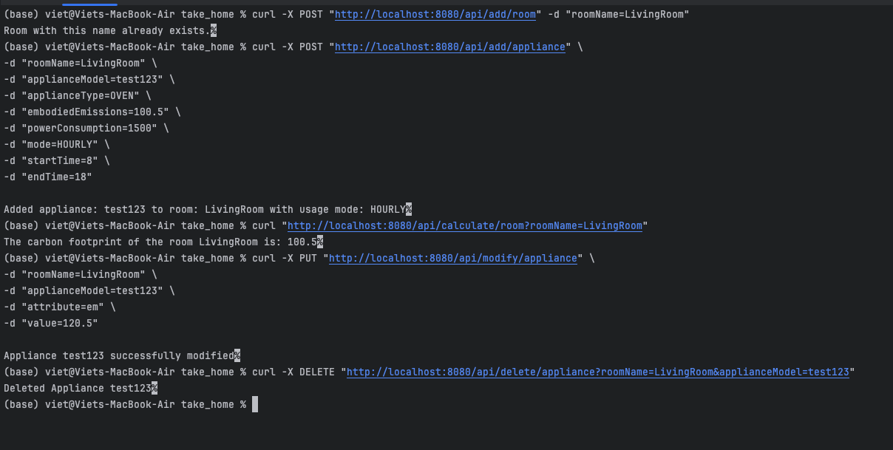

Example Run (meant to be run sequentially)
# adding a room
curl -X POST "http://localhost:8080/api/add/room" -d "roomName=LivingRoom"

# adding an appliance
curl -X POST "http://localhost:8080/api/add/appliance" \
-d "roomName=LivingRoom" \
-d "applianceModel=test123" \
-d "applianceType=OVEN" \
-d "embodiedEmissions=100.5" \
-d "powerConsumption=1500" \
-d "mode=HOURLY" \
-d "startTime=8" \
-d "endTime=18"

# Carbon footprint of living room
curl "http://localhost:8080/api/calculate/room?roomName=LivingRoom"

# listing the appliances
curl "http://localhost:8080/api/list/all-appliances"

# edit an appliance attribute
curl -X PUT "http://localhost:8080/api/modify/appliance" \
-d "roomName=LivingRoom" \
-d "applianceModel=test123" \
-d "attribute=em" \
-d "value=120.5"

# delete the appliance
curl -X DELETE "http://localhost:8080/api/delete/appliance?roomName=LivingRoom&applianceModel=test123"
# Example run terminal image
